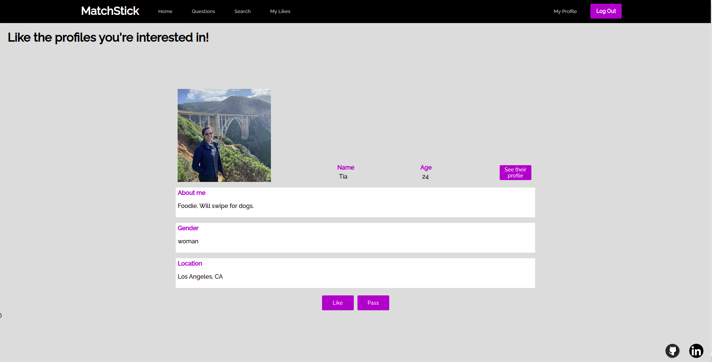

# MatchStick

MatchStick is a clone of OkCupid, an online dating site. Users can create their own profiles and see other profiles. If they like other user's profiles, users can like those profiles.

Matchstick uses React and Redux in the front-end, and Rails and Postgres in the back-end.

## Stack used

* Ruby on Rails (5.2.3)
* PostgreSQL 
* React with Redux

## Features

### User Profiles and Personality Questions
Upon making a new profile, users are directed to the new profile page. On this page, users enter basic information about themselves, including name, age, gender, and location. 

When creating a profile, users are also asked to answer questions about what they are looking for in their ideal person. This match preferences and basic information form shows one question at a time instead of all of the questions at once. The profile form container has functions that return what should be rendered for each question. The local state keeps track of what question the user is on. Upon clicking the next or back button, the question slice of state is increased or decreased by 1, and the appropriate function is returned based on the new question state. 

```
// frontend/components/profiles/profile_form.jsx - question that will render

const questionOne = () => (
    <div className="create-profile">

        <div className="profile-1" id="page1">
            <div className="header-container">

                <button className="back-button" onClick={this.handleBack}> &lt; </button> 
            </div>
            <span><span className="onboarding-header-description">About you</span></span>

            <h3 className="profileDetails-field-prompt">What’s your first name?</h3>
            <div className="profile-input">
                <input type="text" className="profile-name-input" value={this.state.title} onChange={this.update('first_name')}></input>
            </div>    
            <button className="onboarding-button" onClick={this.handleClick}>NEXT</button>

        </div> 
    </div>
)
```

```
// frontend/components/profiles/profile_form.jsx - render function

if (this.state.question === 1) {
      return questionOne();
}
```


After completing the profile form, new users are taken to the personality quiz. This form includes questions that allow users to show a little bit of their personality. The answers to these questions are then displayed on their profiles for other users to see.

Once the profile is created, users can see what their profile will look like to users by navigating to the "My Profile" button in the navigation bar. This page is where all of their information will be displayed. From the profile show page, users can edit their match preferences and personality quiz answers. 


Clicking the edit button will take users back to the profile form and personality form. I did this by increasing the value that the question slice of state starts at, so the form renders the first function that returns a page for match preferences. 

```
// frontend/components/profiles/edit_form_profile_container.jsx - increased question slice of state
const msp = (state) => {
    return ({

        profile: state.entities.profiles[getProfile(state)],
        question: 5
    })
};

const mdp = (dispatch) => {
    return ({
        edit: (profile) => dispatch(updateProfile(profile)),
        fetchProfiles: (profiles) => dispatch(fetchProfiles(profiles))
    })
};

export default connect(msp, mdp)(EditProfileForm);
```

When users are finished creating or editing their profile, they are taken to the home page. 

### Home Page

The home page is where users can see other profiles. The home page component iterates through all profiles that you have not liked and shows them one by one. The local state keeps track of what index in this array the shown profile is. The home page displays the basic information about the profile and the photo that user has chosen for their profile. If interested, the user can click the "See their profile" button to see the match preferences and personality quiz results of the profile. The like button adds a like association between the current user and the liked profile. Then the liked profile is removed from the array of profiles. On pass, the index maintained in the local state increases by 1 and shows the next profile in the array. 

```
// frontend/components/home_page/home_page.jsx - pass function
    handlePass (arr) {
        return (e) => {
            this.setState((previousState) => ({
                profIndex: previousState.profIndex + 1
            }))
        }
    }
```




### Likes

After the current user likes a profile on the home page, the liked profile can be seen on the likes page. 


From the likes page, the user can click on any of the profiles to see that profile show page. 


This profile show page details all of the information filled out by the user associated with the selected profile. From this profile show page, the current user can unlike the profile. If the profile is not one of the user's like profiles, the user can like the profile from the profile show page.

```
// frontend/components/profiles/other_profile_show.jsx - logic determining whether like or unlike button shows up on profile show

    {Object.keys(this.props.likes).includes(
        this.props.match.params.profileId
    ) ? (
        <button
        className="home-button"
        id="show"
        onClick={() =>
            this.props.unlikeProfile(this.props.match.params.profileId)
        }
        >
        Unlike
        </button>
    ) : (
        <button
        className="home-button"
        id="show"
        onClick={() =>
            this.props.likeProfile(this.props.match.params.profileId)
        }
        >
        Like
        </button>
    )}
```

## Search

The user can go to the search page to see all of the profiles on the site and filter profiles based on their match preferences. The user can filter by multiple preferences at once. When the user clicks on one of the profiles on the search page, the user is directed to that profiles show page with all of the profile information. 


The filtering is done by keeping track of the selected preference categories in the local state, and then only displaying profiles who match those preferences.  

```
// frontend/components/search/search.jsx - filter profiles based on search criteria saved in the local state 

    {Object.values(profiles).map((profile) => {
        if (
        ((profile.connection === this.state.connection ||
            this.state.connection === "") &&
        (profile.monogamy === this.state.monogamy ||
            this.state.monogamy === "") &&
        (profile.gender === this.state.gender_search ||
            this.state.gender_search === "") &&
        (profile.age >= this.state.min_age_range ||
            this.state.min_age_range === "") &&
        (profile.max_age_range <= this.state.max_age_range ||
            this.state.max_age_range === "")) && this.props.currentUserId !== profile.user_id 
        ) {
        return <ProfileCard profile={profile} />;
        }
    })}
```


### Features to be added later
1. Messaging between users once users have liked each other

